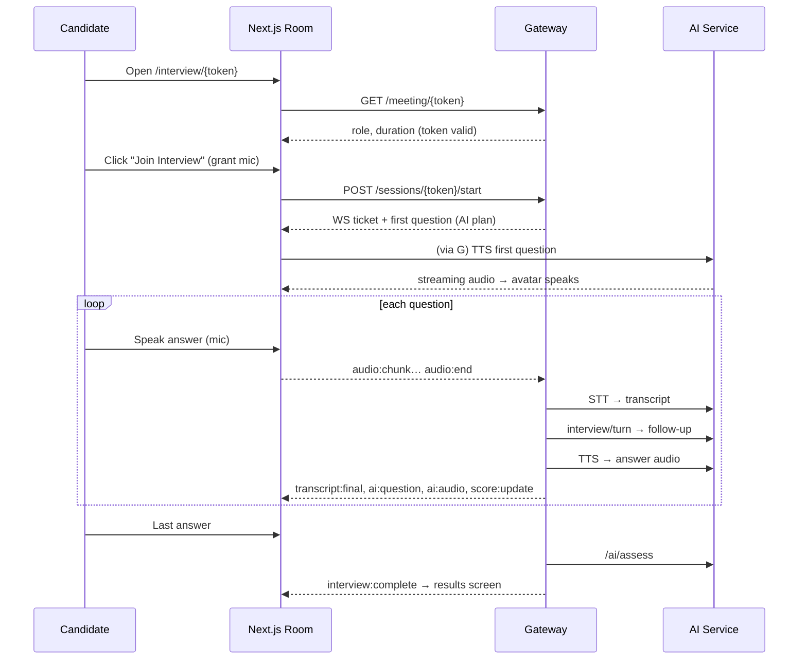
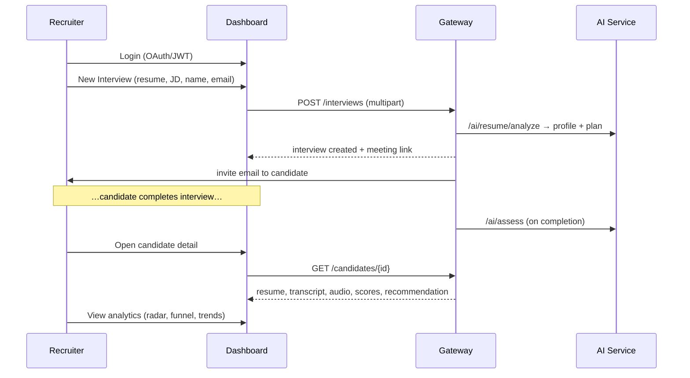
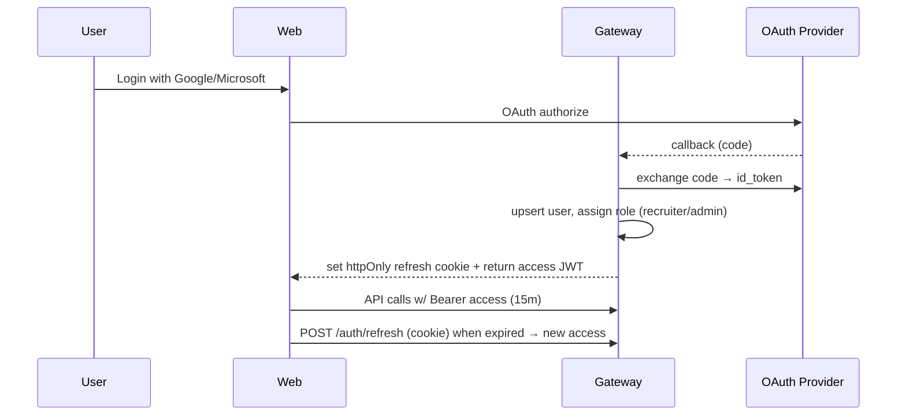

# HireVoice AI — SaaS Platform Architecture

> Transform the working Gradio prototype into a venture-grade, AI-native interview platform —
> **without rewriting the AI logic.**

---

## 0. Guiding principle: reuse the brain, replace the skin

The single most important fact about this migration:

**The AI logic is already decoupled from Gradio.** Everything in `app/` is plain Python:

| Module | Role | Becomes (AI Service endpoint) |
|---|---|---|
| `app/resume_integration.py` | resume parsing (PDF/DOCX/TXT) | `POST /ai/resume/analyze` |
| `app/interviewer.py` | stage machine + question/follow-up generation | `POST /ai/interview/turn` |
| `app/llm.py` | LLM provider (Ollama/OpenAI) | internal — used by all services |
| `app/stt.py` | speech-to-text | `POST /ai/stt/transcribe` |
| `app/tts.py` | text-to-speech | `POST /ai/tts/synthesize` |
| `app/assessment.py` | scoring + hiring recommendation | `POST /ai/assess` |
| `app/session_store.py` | transcript/assessment persistence | replaced by Postgres + S3 |
| `utils/resource_manager.py` | lazy model load/unload | retained inside AI Service |

`ui/gradio_app.py` is the **only** Gradio file — it is retired as the product UI and optionally kept
as an internal `/debug` tool behind auth. **No business logic is lost.** We wrap, we don't rewrite.

---

## 1. System Architecture

Six layers, top to bottom (see rendered diagram):

1. **Client (Next.js 15)** — Candidate Interview Room + Recruiter Dashboard. SSR/edge, desktop & mobile.
2. **Edge** — Nginx / CDN / TLS termination, rate limiting, static asset caching.
3. **API Gateway (FastAPI)** — auth, sessions, recruiter/candidate management, meeting links, WebSocket/Socket.IO hub. Stateless, horizontally scalable.
4. **AI Service (FastAPI)** — thin wrapper around the existing `app/` core. GPU/CPU-bound, scaled independently.
5. **Provider Layer** — abstraction over OpenAI / Claude / Gemini / Ollama / Whisper / ElevenLabs / Piper.
6. **Data** — PostgreSQL (relational), Redis (realtime/cache), S3/R2 (blobs).

**Why two FastAPI services, not one?** The gateway is I/O-bound and scales on request volume;
the AI service is compute-bound (model inference) and scales on GPU/CPU. Splitting them lets you run
many cheap gateway pods and a few expensive AI pods, and keeps a slow model from blocking auth/CRUD.

```
Browser ──HTTPS/WSS──▶ Nginx ──▶ API Gateway ──REST(internal)──▶ AI Service ──▶ Provider Layer
                                     │                                │
                                     ├──▶ PostgreSQL                  └──▶ Redis (model state)
                                     ├──▶ Redis (sessions, pub/sub)
                                     └──▶ S3/R2 (resumes, audio, reports)
```

---

## 2. Frontend Folder Structure (`apps/web` — Next.js 15 App Router)

```
apps/web/
├── app/
│   ├── (marketing)/                 # public site
│   │   ├── page.tsx                 # landing
│   │   └── pricing/page.tsx
│   ├── (auth)/
│   │   ├── login/page.tsx
│   │   └── callback/[provider]/route.ts   # OAuth callback
│   ├── (recruiter)/                 # authed recruiter app
│   │   ├── layout.tsx               # sidebar shell
│   │   ├── dashboard/page.tsx       # overview KPIs
│   │   ├── candidates/
│   │   │   ├── page.tsx             # list + search/filter
│   │   │   └── [id]/page.tsx        # candidate detail
│   │   ├── interviews/
│   │   │   ├── new/page.tsx         # create interview wizard
│   │   │   └── [id]/page.tsx
│   │   └── analytics/page.tsx       # radar, trends, funnel
│   ├── interview/
│   │   └── [token]/page.tsx         # CANDIDATE ROOM (public, token-gated)
│   ├── api/                         # BFF route handlers (proxy → gateway)
│   └── layout.tsx                   # root, theme provider, fonts
├── components/
│   ├── ui/                          # ShadCN primitives (button, dialog, card…)
│   ├── interview/
│   │   ├── AiAvatar.tsx             # idle/speaking/listening/thinking states
│   │   ├── VoiceWaveform.tsx        # wavesurfer.js live waveform
│   │   ├── MicButton.tsx            # record + animation + level meter
│   │   ├── LiveTranscript.tsx       # streamed STT
│   │   ├── QuestionCard.tsx
│   │   ├── ProgressRing.tsx
│   │   └── InterviewTimer.tsx
│   ├── assessment/
│   │   ├── ScoreBar.tsx             # animated bars
│   │   ├── ScoreRadar.tsx           # recharts radar
│   │   ├── StrengthsList.tsx
│   │   └── RecommendationCard.tsx
│   ├── dashboard/
│   │   ├── KpiCard.tsx
│   │   ├── HiringFunnel.tsx
│   │   ├── CandidateTable.tsx
│   │   └── TrendChart.tsx           # recharts line/area
│   └── layout/ (Sidebar, Topbar, MobileNav)
├── lib/
│   ├── api.ts                       # typed REST client
│   ├── ws.ts                        # Socket.IO client + event types
│   ├── audio/
│   │   ├── recorder.ts              # MediaRecorder + VAD
│   │   ├── player.ts                # streaming TTS playback
│   │   └── analyser.ts              # WebAudio frequency data → waveform
│   ├── auth.ts                      # session/JWT helpers
│   └── utils.ts (cn, formatters)
├── hooks/ (useInterviewSocket, useRecorder, useTts, useCountdown)
├── stores/ (interview.store.ts, auth.store.ts — Zustand)
├── styles/ (globals.css — theme tokens, Tailwind layers)
├── types/ (api.ts, ws.ts, domain.ts — shared w/ backend via codegen)
├── public/ (avatar sprites, sfx)
├── tailwind.config.ts
└── next.config.ts
```

---

## 3. Backend Folder Structure (monorepo)

```
hirevoice-ai/
├── apps/web/                        # Next.js (above)
├── services/
│   ├── gateway/                     # FastAPI — API gateway
│   │   ├── app/
│   │   │   ├── main.py              # FastAPI app + Socket.IO mount
│   │   │   ├── config.py            # pydantic-settings
│   │   │   ├── deps.py              # DI: db session, current_user
│   │   │   ├── api/v1/
│   │   │   │   ├── auth.py          # login, oauth, refresh
│   │   │   │   ├── recruiters.py
│   │   │   │   ├── candidates.py
│   │   │   │   ├── interviews.py    # CRUD + create-with-plan
│   │   │   │   ├── sessions.py      # live session lifecycle
│   │   │   │   ├── meeting_links.py
│   │   │   │   └── analytics.py
│   │   │   ├── ws/
│   │   │   │   ├── manager.py       # connection registry (Redis-backed)
│   │   │   │   └── events.py        # event handlers
│   │   │   ├── core/ (security.py JWT, oauth.py, rbac.py)
│   │   │   ├── models/              # SQLAlchemy ORM
│   │   │   ├── schemas/             # pydantic request/response
│   │   │   ├── services/
│   │   │   │   ├── ai_client.py     # httpx client → AI Service
│   │   │   │   ├── storage.py       # S3/R2 presigned URLs
│   │   │   │   ├── email.py         # invite emails
│   │   │   │   └── interview_orchestrator.py
│   │   │   └── repositories/        # data access
│   │   ├── alembic/                 # migrations
│   │   └── tests/
│   └── ai/                          # FastAPI — AI Service (wraps app/)
│       ├── app/
│       │   ├── main.py              # endpoints → existing app/ functions
│       │   ├── routers/ (resume, interview, stt, tts, assess)
│       │   ├── providers/           # provider abstraction (see §11)
│       │   │   ├── base.py
│       │   │   ├── openai_provider.py
│       │   │   ├── claude_provider.py
│       │   │   ├── ollama_provider.py
│       │   │   └── registry.py
│       │   └── schemas.py
│       └── core/  ── imports ──▶  /app (existing AI logic, unchanged)
├── app/                             # EXISTING AI core — untouched
├── packages/
│   ├── shared-types/                # OpenAPI-generated TS types
│   └── eslint-config/
├── db/
│   └── schema.sql                   # canonical schema (see §4)
├── infra/
│   ├── docker-compose.yml           # local dev (all services + pg + redis)
│   ├── Dockerfile.gateway
│   ├── Dockerfile.ai
│   ├── Dockerfile.web
│   ├── nginx/nginx.conf
│   └── k8s/                         # manifests / helm chart
├── .github/workflows/               # CI/CD
└── docs/ARCHITECTURE.md             # this file
```

---

## 4. Database Schema

Full DDL lives in [`db/schema.sql`](../db/schema.sql). Core tables:

```
users ──┬──< recruiters
        └──< candidates
recruiters ──< interviews >── candidates
interviews ──1:1── meeting_links
interviews ──< questions ──< responses ──1:1── transcripts
responses ──< audio_files
interviews ──1:1── assessments
candidates ──< resumes
* ──< audit_logs ;  analytics_events (append-only)
```

Key design choices:
- **UUID PKs** everywhere (safe to expose, no enumeration).
- `meeting_links.token` is a 128-bit URL-safe secret, single interview, expiring.
- `interviews.status` enum: `created → invited → in_progress → completed → assessed → archived`.
- `assessments` stores both the structured scores (jsonb) **and** the raw model output for audit.
- Soft-delete via `deleted_at` on user-facing tables; hard data lives in S3 with lifecycle rules.
- All blobs (`resumes`, `audio_files`, reports) store an **S3 key**, never bytes in Postgres.

---

## 5. API Design (REST, `/api/v1`, gateway)

| Method | Path | Auth | Purpose |
|---|---|---|---|
| POST | `/auth/login` | — | email/password → JWT pair |
| GET | `/auth/oauth/{google\|microsoft}` | — | OAuth redirect |
| POST | `/auth/refresh` | refresh | rotate access token |
| GET | `/recruiters/me` | recruiter | profile + org |
| POST | `/interviews` | recruiter | create interview → triggers resume analysis + plan + meeting link |
| GET | `/interviews` | recruiter | list (filter by status/candidate) |
| GET | `/interviews/{id}` | recruiter | full detail |
| GET | `/candidates` | recruiter | search/filter/paginate |
| GET | `/candidates/{id}` | recruiter | resume, transcript, audio, assessment |
| GET | `/meeting/{token}` | public | resolve token → interview metadata (no PII leak) |
| POST | `/sessions/{token}/start` | candidate-token | begin live session, returns WS ticket |
| POST | `/sessions/{id}/answer` | candidate-token | submit audio answer (multipart) |
| POST | `/sessions/{id}/end` | candidate-token | finalize → assessment job |
| GET | `/analytics/overview` | recruiter | KPIs |
| GET | `/analytics/trends` | recruiter | score/duration/confidence series |
| GET | `/storage/presign` | authed | presigned upload/download URL |

**AI Service (internal only, not exposed to browser):**

| Method | Path | Purpose |
|---|---|---|
| POST | `/ai/resume/analyze` | parse resume → structured profile + interview plan |
| POST | `/ai/interview/turn` | given history+stage → next question/follow-up |
| POST | `/ai/stt/transcribe` | audio → text |
| POST | `/ai/tts/synthesize` | text → audio stream |
| POST | `/ai/assess` | transcript+resume → scores + recommendation |
| GET | `/ai/health` | model/provider readiness |

Conventions: cursor pagination, `problem+json` errors, idempotency keys on POST, OpenAPI 3.1 (drives TS codegen).

---

## 6. WebSocket Event Design (Socket.IO, namespace `/interview`)

Room = `interview:{sessionId}`. Candidate and (optionally observing) recruiter join the same room.

**Client → Server**
| Event | Payload | Effect |
|---|---|---|
| `session:join` | `{ token }` | validate, join room, emit current state |
| `audio:chunk` | `{ seq, blob }` | stream answer audio for incremental STT |
| `audio:end` | `{ responseId }` | finalize answer → STT → LLM → TTS pipeline |
| `candidate:state` | `{ speaking, level }` | VAD/level for UI sync |

**Server → Client**
| Event | Payload | UI binding |
|---|---|---|
| `interview:state` | `{ stage, questionIndex, total, timer }` | progress, counter |
| `transcript:partial` | `{ text }` | live transcript (interim) |
| `transcript:final` | `{ responseId, text }` | committed transcript bubble |
| `ai:thinking` | `{ on: bool }` | avatar "thinking" + typing indicator |
| `ai:question` | `{ text, stage }` | question card |
| `ai:audio` | `{ url \| chunk }` | streaming TTS playback + avatar "speaking" |
| `score:update` | `{ technical, communication, confidence, alignment }` | live score panel |
| `interview:complete` | `{ assessmentId }` | redirect to thank-you/results |

Transport: WSS, JWT/handshake ticket per session, heartbeat, auto-reconnect with resume offset.
Fallback: Server-Sent Events for transcript/score if WS blocked by corporate proxy.

---

## 7. Meeting Link Architecture

```
Recruiter "Create Interview"
  → gateway creates interview (status=created)
  → AI Service analyzes resume + builds plan
  → gateway issues meeting_link:
        token   = secrets.token_urlsafe(32)        # 256-bit
        url     = https://interview.company.com/interview/{token}
        expires = now + 7d (configurable)
  → status=invited, email sent to candidate
Candidate opens link
  → GET /meeting/{token}  →  validates (exists, not expired, not consumed)
  → returns { role, duration, recruiterOrg }  (no candidate PII)
  → candidate page mints a short-lived candidate-session JWT for WS/answers
On first start → token marked consumed (single active session); re-entry allowed until completion.
```

Security: token is opaque + random (no candidate id embedded), rate-limited resolution, one-time
consumption, expiry, and revocable by recruiter. Never put candidate identity in the URL.

---

## 8. Candidate Journey Flow



---

## 9. Recruiter Journey Flow



---

## 10. Authentication Flow



- **Roles:** `admin`, `recruiter`, `candidate` (candidate uses scoped session token, not full login).
- **JWT:** short access (15m) + rotating refresh (httpOnly, 30d). RBAC enforced in `deps.py`.
- **Candidate access:** no account; meeting token → ephemeral session JWT scoped to one interview.

---

## 11. AI Service Integration Plan + Provider Abstraction

The AI Service imports the existing `app/` package and exposes it over HTTP. The **provider
abstraction** lets you swap model vendors without touching application logic:

```python
class LLMProvider(Protocol):
    def chat(self, messages, *, temperature, max_tokens) -> str: ...
class STTProvider(Protocol):
    def transcribe(self, audio_path, *, language="en") -> str: ...
class TTSProvider(Protocol):
    def synthesize(self, text) -> bytes: ...

# registry.py picks implementation from env/config:
#   LLM:  ollama | openai | claude | gemini
#   STT:  faster_whisper | openai_whisper
#   TTS:  piper | elevenlabs | openai
PROVIDERS = ProviderRegistry.from_settings(settings)
```

The existing `app/llm.py`, `app/stt.py`, `app/tts.py` already have an OpenAI/local toggle — we
generalize that toggle into the registry. `app/interviewer.py` and `app/assessment.py` keep their
exact logic; they just call `PROVIDERS.llm.chat(...)` instead of importing a concrete client.

---

## 12. Gradio → API Migration Plan

| Step | Action | Risk |
|---|---|---|
| 1 | Stand up `services/ai` FastAPI that imports `app/` and exposes the 6 endpoints (§5). Reuse `ResourceManager`. | low — pure wrap |
| 2 | Generalize local/OpenAI toggle → `providers/registry.py`. | low |
| 3 | Add gateway with auth + interviews CRUD + Postgres. | med |
| 4 | Build candidate room in Next.js hitting gateway → AI service. | med |
| 5 | Move transcript/assessment persistence from `session_store.py` (JSON files) → Postgres + S3. | low |
| 6 | Wire WebSocket live transcript/score/TTS streaming. | med |
| 7 | Recruiter dashboard + analytics. | med |
| 8 | Retire `ui/gradio_app.py` as product UI; keep behind `/debug` (admin-only) or delete. | low |

**Nothing in `app/` changes behaviorally.** Tests in `tests/` keep passing throughout (regression net).

---

## 13. UI Wireframes

**Candidate Interview Room (desktop)**
```
┌──────────────────────────────────────────────────────────────┐
│  ◐ Pranit Raj · Senior Backend       Q 3/8   ⏱ 12:04   ● live │
├───────────────────────────────┬──────────────────────────────┤
│                               │  AI Analysis                  │
│        ╭─────────────╮         │  Communication  ████████░ 82% │
│        │  AI AVATAR  │  ◜◝     │  Technical      ███████░░ 74% │
│        │  (speaking) │ ((( ))) │  Confidence     █████████ 91% │
│        ╰─────────────╯         │  Resume align   ████████░ 85% │
│   ～～ live waveform ～～         │  Keyword match  ███████░░ 70% │
│                               │                               │
│  "Walk me through how you'd   │  Strengths                    │
│   scale the write path?"      │  ✓ API design ✓ Architecture  │
│                               │  Improve                      │
│   ┌────────────────────────┐   │  ⚠ Caching  ⚠ Distributed     │
│   │   ◉  HOLD TO SPEAK      │   │                               │
│   └────────────────────────┘   │  [ Next Question → ]          │
│   transcript: "I'd start by…"  │                               │
└───────────────────────────────┴──────────────────────────────┘
```

**Recruiter Dashboard**
```
┌─ HireVoice ─────────────────────────────────────────────────┐
│ Sidebar │  Overview                                          │
│ ▸ Home  │  ┌Interviews┐ ┌Candidates┐ ┌Avg Score┐ ┌Hires┐    │
│ ▸ Cand. │  │   128    │ │   96     │ │  7.8/10 │ │ 21  │    │
│ ▸ Inter.│  └──────────┘ └──────────┘ └─────────┘ └─────┘    │
│ ▸ Analyt│  Hiring Funnel  ▇▇▇▇▇▇▇▇ invited                  │
│         │                 ▇▇▇▇▇▇ completed                  │
│         │                 ▇▇▇ recommended                   │
│         │  Recent Candidates                                 │
│         │  Name        Role        Score  Status   →         │
│         │  A. Chen     Backend     8.4    ✓ Hire             │
│         │  P. Raj      Full-stack  7.8    Maybe              │
└─────────┴────────────────────────────────────────────────────┘
```

**Candidate Detail**
```
┌ ← Candidates / Pranit Raj ───────────────────────────────────┐
│ [Resume] [Transcript] [Audio] [Questions] [Assessment]        │
│ ╭ Recommendation: HIRE ───────────╮  ╭ Radar ──────────╮      │
│ │ Overall 7.8/10                  │  │   technical      │      │
│ │ Detailed AI explanation…        │  │  ╱╲   comm       │      │
│ ╰─────────────────────────────────╯  │ confidence align │      │
│ Transcript ▸ 00:12 "Hello, my name…" └──────────────────╯      │
└───────────────────────────────────────────────────────────────┘
```

---

## 14. Component Hierarchy (interview room)

```
InterviewRoomPage
├── InterviewProvider (ws + state, Zustand)
├── TopBar (CandidateChip, ProgressRing, QuestionCounter, InterviewTimer, LiveBadge)
├── StageGrid
│   ├── AiInterviewerPanel
│   │   ├── AiAvatar (idle|speaking|listening|thinking)
│   │   ├── VoiceWaveform (wavesurfer)
│   │   ├── QuestionCard
│   │   └── AudioControls (replay, mute, speed)
│   ├── CandidatePanel
│   │   ├── MicButton (record + level meter + noise badge)
│   │   ├── RecordingPulse
│   │   └── LiveTranscript
│   └── AnalysisPanel
│       ├── ScoreBar ×5 (animated)
│       ├── StrengthsList / ImprovementsList
│       └── NextQuestionButton
└── CompletionOverlay (on interview:complete)
```

---

## 15. Dashboard Design

- **Overview:** 5 `KpiCard`s (total interviews, candidates, avg score, recommended hires, conversion rate) with animated count-up + sparkline; `HiringFunnel`; `TrendChart` (score over time).
- **Candidates:** `CandidateTable` with server-side search/filter/sort, status chips, row → detail.
- **Candidate Detail:** tabbed (Resume viewer, Transcript w/ audio scrubber, Question history, `ScoreRadar`, `RecommendationCard`).
- **Analytics:** radar (skill breakdown), multi-series trends (communication/confidence/duration), funnel.
- Glassmorphism cards, `#6C63FF` accent, Framer Motion stagger on mount, skeleton loaders during fetch.

---

## 16. Interview Room Design

- **AI Avatar** with 4 states driven by WS events: `idle` (breathing), `speaking` (waveform + glow synced to TTS amplitude), `listening` (mic glow), `thinking` (particles + typing dots on `ai:thinking`).
- **Voice:** wavesurfer.js live input waveform; WebAudio `AnalyserNode` → frequency bars; VAD-based speaking indicator + noise badge; ElevenLabs-style frequency animation.
- **Flow:** TTS streams AI question → candidate holds-to-speak → interim transcript streams in → on release, pipeline runs (`ai:thinking` on) → next question. Live scores update per turn.
- Premium feel: dark `#071120` canvas, soft glows, smooth Framer transitions, zero "form" chrome.

---

## 17. Mobile Design

- Candidate room is **mobile-first** (most candidates join on phones):
  - Single column: avatar top, big mic button thumb-reachable bottom, transcript scrolls, analysis behind a swipe-up sheet.
  - `getUserMedia` audio, screen-wake-lock, graceful mic-permission UX, reconnect on network flap.
- Recruiter dashboard responsive: sidebar → bottom nav, tables → stacked cards, charts reflow.
- Breakpoints: mobile 375, tablet 768, laptop 1024, desktop 1280. Test matrix per breakpoint.

---

## 18. Deployment Architecture

```
                ┌────────── Cloudflare (DNS, CDN, WAF) ──────────┐
Internet ──────▶│  interview.company.com / app.company.com       │
                └───────────────┬────────────────────────────────┘
                                ▼
                       Nginx Ingress (k8s)
        ┌───────────────┬───────────────┬───────────────┐
        ▼               ▼               ▼               ▼
   web (Next.js)   gateway (FastAPI)  ai (FastAPI)   socket workers
   HPA 2–10        HPA 3–20           HPA 1–6 (GPU)   (sticky/Redis adapter)
        │               │               │
        └───────────────┴───────┬───────┘
                                ▼
        PostgreSQL (primary+replica)   Redis (cluster)   S3/R2
```

- Containerized (Docker), orchestrated on Kubernetes; AI pods on GPU node pool (or CPU pool for Ollama/Whisper).
- Local dev via `infra/docker-compose.yml` (web + gateway + ai + postgres + redis + minio).
- Secrets via k8s Secrets / cloud secret manager; config via env (12-factor).

---

## 19. CI/CD Architecture (GitHub Actions)

```
PR  → lint (ruff, eslint) → typecheck (mypy, tsc) → unit tests (pytest, vitest)
    → build images → e2e (Playwright against compose) → preview deploy
main→ build + push images (GHCR) → migrate (alembic) → deploy staging
    → smoke tests → manual gate → deploy prod (rolling) → post-deploy checks
```

- Existing `tests/` (63 passing) run on every PR as the AI-core regression gate.
- Frontend: Playwright e2e for the candidate journey; visual regression on key screens.
- Image scanning (Trivy), dependency audit, SBOM. Blue/green or rolling with auto-rollback on health-check failure.

---

## 20. Production Scaling Strategy

| Concern | Strategy |
|---|---|
| Concurrent interviews | Stateless gateway pods (HPA on RPS); session state in Redis, not memory |
| Model inference cost | AI pods scale separately on GPU/CPU; queue + backpressure; per-tenant rate limits |
| Realtime fan-out | Socket.IO Redis adapter so any pod can reach any room; sticky sessions optional |
| STT/TTS latency | Stream chunks; cache TTS for repeated AI phrases; pick model by tier (small.en default) |
| Provider failover | Registry retries/falls back across OpenAI↔Claude↔Ollama; circuit breakers |
| Data growth | Audio/resumes in S3 w/ lifecycle (cold storage after 90d); Postgres partition `analytics_events` by month |
| Multitenancy | `org_id` on every row; row-level security; per-org quotas |
| Observability | OpenTelemetry traces across gateway→ai→provider; Prometheus/Grafana; structured logs; Sentry |
| Reliability | PG primary+replica w/ PITR; Redis cluster; health/readiness probes; graceful model unload on SIGTERM |

---

## Design System — "Dark Luxury"

```
Background  #071120   Surface  rgba(255,255,255,.04) (glass)   Border rgba(255,255,255,.08)
Accent      #6C63FF   Secondary #4CC9F0               Success #00C896  Warn #F5A524  Danger #FF5C7A
Text        #E8ECF4 / muted #8A95A8
Font        Inter (UI), SF Pro fallback, JetBrains Mono (code/scores)
Radius      12–16px   Glass blur 16px   Shadow soft glow on accent
Motion      Framer Motion — page fade/slide, hover lift, score count-up, avatar state springs
```

---

## Phased Roadmap

1. **Foundation** — monorepo + `services/ai` (wrap `app/`) + provider registry + Postgres schema + compose. *(scaffolded in this branch)*
2. **Gateway** — auth (JWT + OAuth), interviews CRUD, meeting links, storage.
3. **Candidate Room** — Next.js room, avatar, voice, live transcript, WS pipeline.
4. **Assessment + Dashboard** — recruiter dashboard, candidate detail, analytics.
5. **Hardening** — CI/CD, k8s, observability, scaling, security review.

See `infra/docker-compose.yml`, `db/schema.sql`, and `services/ai/` for the scaffolded foundation.
